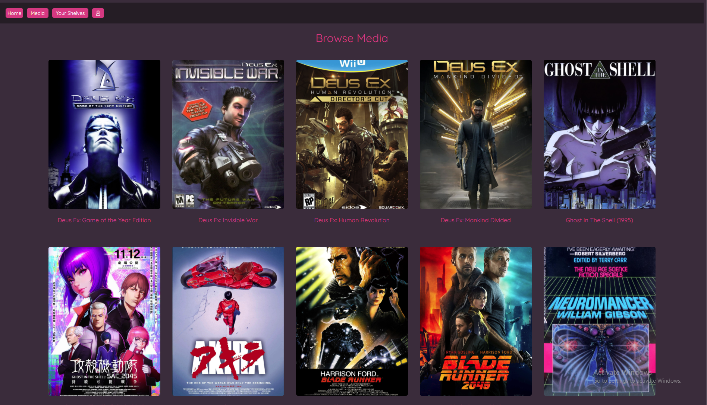
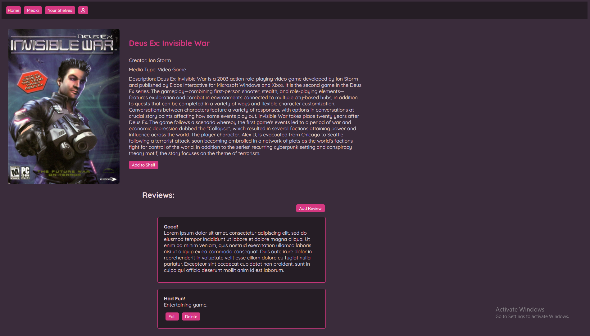
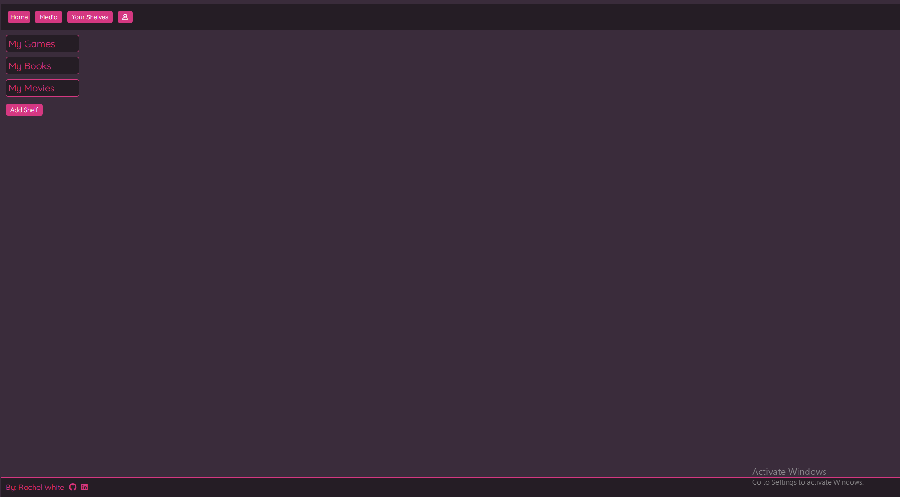

# The Net Archives

The Net Archives is a GoodReads clone dedicated to the cyberpunk genre. It goes beyond books and includes other formats of media including, but not limited to: movies, video games, and TV series.

# Live Site

[Check out the live site!](https://the-net-archives.herokuapp.com/)

# Technologies Used
        

# Frontend Routes

[View frontend routes here](https://github.com/rcwhite96/the-net-archives/wiki/Frontend-Routes)

# Backend Routes

[View backend routes here](https://github.com/rcwhite96/the-net-archives/wiki/Backend-Routes)

# Features

### Media

View various media.

### Reviews

Add, delete and edit reviews to media.

### Shelves

Add, delete and edit shelves to save your favorite media.

# Setting Up Local Use

1. Clone the repo from GitHub.

2. Open the root folder in VSCode.

3. Run NPM install in the frontend and backend directories to install all dependencies.

4. Create a .env, and copy the .env.example file into it.

5. Create a user in Postgres with the username and password set in your .env file, with CREATEDB.

6. To create your database, run the command: npx dotenv sequelize db:create.

7. To migrate the database, run the command: npx dotenv sequelize db:migrate.

8. To seed the database, run the command: npx dotenv sequelize db:seed:all

9. Open a second terminal. In one, go into the backend directory and run npm start. In the other, go into the frontend directory and run npm start. This should start up both servers and open the app in your browser.

# Future Plans

✅ Add a carousel to the splash page.

- Responsiveness - users will be able to view the app on a mobile device.

- Implement AWS S3 for photo storage.

- Add a media status - a user will be able to label a piece of media as viewed/read or not yet viewed/read.
